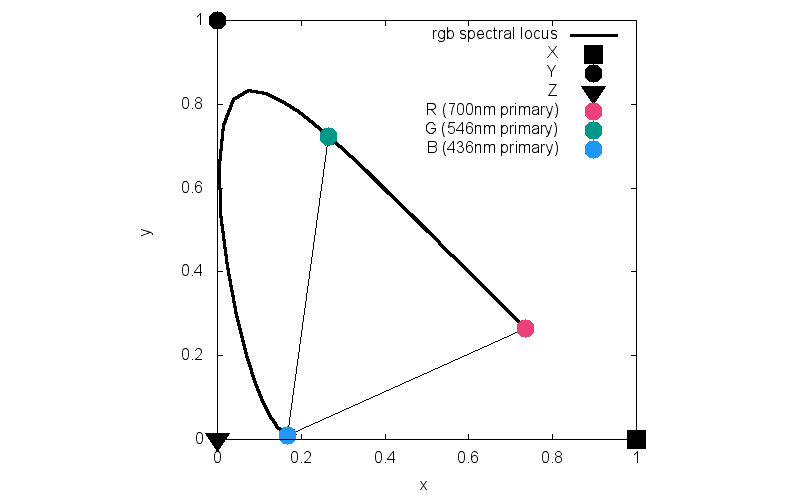
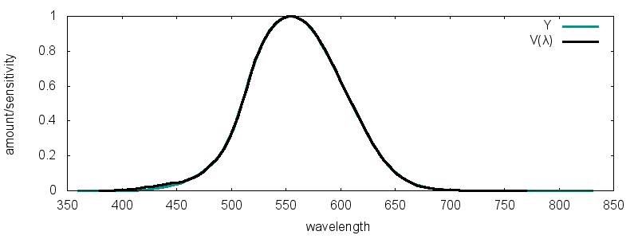

# A Beginner's guide to (CIE) Colorimetry

- [A Beginner's guide to (CIE) Colorimetry](#a-beginners-guide-to-cie-colorimetry)
  - [1) Trichromatic Color Theory](#1-trichromatic-color-theory)
  - [2) 1924 Luminous Efficiency Function, `V(λ)`](#2-1924-luminous-efficiency-function-vλ)
  - [3) 1931 RGB Color Matching Functions](#3-1931-rgb-color-matching-functions)
  - [4) Wright Guild Color Matching Experiments](#4-wright-guild-color-matching-experiments)
    - [About those negative values](#about-those-negative-values)
    - [Restrictions on viewing conditions](#restrictions-on-viewing-conditions)
  - [5) RGB Chromaticity Coordinates](#5-rgb-chromaticity-coordinates)
    - [One Weird Trick](#one-weird-trick)
  - [7) CIE XYZ Color Space](#7-cie-xyz-color-space)
  - [8) Real World Color Spaces](#8-real-world-color-spaces)
  - [9) Beyond Color Matching](#9-beyond-color-matching)
  - [10) Acknowledgments, Further Reading](#10-acknowledgments-further-reading)
    - [Books](#books)
    - [Papers](#papers)
    - [Misc](#misc)

[Link to Original Medium.com](https://medium.com/hipster-color-science/a-beginners-guide-to-colorimetry-401f1830b65a)

[Chandler Abraham @cba](https://medium.com/@cba)

Sep 11, 2016

18 min read


**Edit 2017: This was the first thing I ever wrote about color. I’m older and wiser and I wanted to issue a few disclaimers. Understanding the foundation of CIE colorimetry is very practical but here are some things to remember.**

* **Edit 2017: This was the first thing I ever wrote about color. I’m older and wiser and I wanted to issue a few disclaimers. Understanding the foundation of CIE colorimetry is very practical but here are some things to remember.**
* **CIE colorimetry isn’t the whole story of colorimetry. It’s the modern standard but the theoretical work was done by James Maxwell in the 1850s.**
* **Differentiating theoretical colorimetry from the CIE’s implementation of it will be a milestone in your understanding. I recommend Jan Koenderink’s Color For the Sciences: [MIT-Press Color Science Book](https://mitpress.mit.edu/books/color-sciences)**

Feedback welcome: cbabraham@gmail.com

This blog post is an introduction to the CIE 1931 color system, an international standard model of human color vision that is used all around you. Do you see any color prints around you? Are you reading this on a color display? All of that is made possible by CIE 1931.

Commission internationale de l’éclairage (CIE) is a 100 year old organization that creates international standards related to light and color.

CIE 1931 is a Color Matching System. Color matching does not attempt to describe how colors appear to humans, color matching tells us how to numerically specify a measured color, and then later accurately reproduce that measured color (e.g. in print or digital displays).

To reiterate that point, Color Matching Systems are not focused on describing color with qualities like hue or saturation, they just tell us what combinations of light appear to be the same color to most people (they “match”). Color matching allows gives us a basic framework for color reproduction.

You can think of CIE 1931 like you would Newtonian physics. It’s a mathematical generalization of human color vision, that allows us to define, and accurately reproduce colors in most situations. It does not fully describe the subjective and complicated process of human color vision, it’s not without edge cases, but it is relatively easy to work with.

1. Trichromatic Color Theory
2. 1924 Luminous Efficiency Function, V(λ)
3. 1931 RGB Color Matching Functions
4. Wright Guild Color Matching Experiments
5. RGB Chromaticity Coordinates
6. Non-Spectral Colors
7. CIE XYZ Color Space
8. Real World Color Spaces
9. Beyond Color Matching
10. Acknowledgements, Further Reading

## 1) Trichromatic Color Theory

A principal quality of light is its wavelength. Humans can perceive light with waves as small as `~380nm` and as large as `~750nm`.

The sun emits light across many wavelengths and objects around us reflect some wavelengths and absorb some wavelengths. Below is the spectral distribution of a spinach leaf illuminated by sunlight. The leaf absorbs most wavelengths as heat, but reflects visible light around `550nm`. We see this particular reflected spectral composition as green.


Inside the eye there are three types of cone photoreceptors called Long, Medium and Short that contribute to color discrimination. They are all sensitive to different, yet overlapping, wavelengths of light. They are commonly associated with the color they are most sensitive too, `L = red`, `M = green`, `S = blue`.


When you view the charts overlaid, you can see that the spinach mostly reflects light outside of the eye’s visual range, and inside our range it mostly reflects light centered around our M cone.


The eye’s cone system takes a complex spectral distribution (like the spinach) and reduces it down to three numerical values, each representing how much the three cones were stimulated. These cone values are fed into the next part of the brain’s visual processing pipeline, which we won’t go into (see: [Wikipedia Opponent Color Theory](https://en.wikipedia.org/wiki/Opponent_process)).

This is important: The trichromatic process is lossy, you can’t go from the output of the cones back to the original spectral distribution. **This is because different spectral distributions can stimulate the cones in the exact same way.**

Shown here are two different spectral distributions that are indistinguishable to the human eye. You can see that the M cone is stimulated by both distributions equally, just on opposite ends of the cone’s sensitivity range.


You could imagine a leaf and a green car that look the same to you, but physically have different reflectance properties. It turns out every color (or, unique cone output) can be created from many different spectral distributions. Color science started to make a lot more sense when I finally understood this.

This phenomenon is called metamerism and it has huge ramifications for color reproduction. It means we don’t need the original light to reproduce an observed color. We can reproduce a color if we can create a spectral distribution of light with the same cone response as the original distribution.

This is why you can create a color that looks like spectral yellow on a LCD display that has no yellow lights. The LCD can combine red and green light in the right amounts to mimic the human cone response of spectral yellow light.

CIE 1931 is a model that tell us how to create these matches. Excited yet?

## 2) 1924 Luminous Efficiency Function, `V(λ)`

*tip: `λ` means wavelength*

Before the fundamental work of colorimetry occurred CIE published a function, `V(λ)`, that describes the human eye’s sensitivity to light at different wavelengths in daylight.


What this tell us is that two lights, 550nm and 400nm can have the same radiance (an objective unit) but appear to have different brightnesses.

Or to put it another way, if you have a green and blue light that appear to be equally bright, then you know that the blue light is more luminous.

Note: The 1924 `V(λ)` was eventually shown to under represent our sensitivity at the blue end of the spectrum.

## 3) 1931 RGB Color Matching Functions

CIE 1931 contains 3 functions called the RGB color matching functions.

Let’s say you have three lights, a red and green and a blue with precisely known single wavelengths. If you point these lights at the same spot on the wall is it possible to adjust the power of each light until the spot had the exactly same color as 540nm light?

This is exactly the kind of question color matching functions can answer. Color Matching functions have three fixed primary colors and each function outputs the amount of primary needed to create a desired color when all three are mixed.

`700nm`, `546.1nm` and `435.8nm` are the primaries of the 1931 RGB color matching functions: `r(λ)`, `g(λ)`, `b(λ)`. Plotted below.


Let’s use this to make some matches in our hypothetical light setup. Note, this scenario is going to seem very specific and contrived but later we will show how it can be generalized to explain all color matches.

We’ll pick a target wavelength of `610nm`, the goal is to reproduce the color of this light with our primary lights.

```py
λ = 610nm r(λ) = 0.34756 g(λ) = 0.04776 b(λ) = -0.00038
```


One quirk about these functions, they are scaled as if all the primary lights are equally bright. As mentioned earlier, a blue light must be more luminous than an equally bright green light. So in order to get absolute luminance needed for our match, we must un-scale the values using a set of relative luminance values provided to us along with the function.

```py
Lr = 1 # r luminance scale 
Lg = 4.5907 # g luminance scale 
Lb = 0.0601 # b luminance scale 
λ = 610nm 
R = r(λ)/Lr = 0.34756 
G = g(λ)/Lg = 0.04776 
B = b(λ)/Lb = -0.00038
```

The resulting values R, G, and B are called **tristimulus values**, they are the required luminosity of the test lights to achieve a color match.

Instead of subjecting you to the colorimetric equations that describes this match, here’s a diagram of the scenario.


Since blue is negative, we leave the light off because negative light isn’t possible. What this means is that we actually can’t create a perfect match of 610nm light with these primaries, but by using the positive amounts of red and green we can create something very close. Negative values are explored more in the next section.

The exercise we’ve described is not a day-to-day use of color matching functions, but as we will see arranging these lights is similar to how you might vary the intensity of rgb sub-pixels to create an LCD pixel of a desired color.

## 4) Wright Guild Color Matching Experiments

I used the lighting arrangement in the previous section as a demonstration of a physical application of the color matching functions, but it actually has its origins in the creation of those functions.

In the 1920s two color scientists, W. D. Wright and J. Guild, each performed similar color vision experiments. Wright performed his experiment on 10 subjects, Guild used 7. Their results agreed with each other so well that they were combined by CIE to create the RGB color matching functions we’ve been discussing.

Color vision can sometimes vary, so it was important to find test subjects with no color vision deficiencies or yellowing of the lens (happens with old age) in order to create functions that worked for the average person. The combination of the Wright Guild subject data is known as the 1931 Standard Observer.

The experiment setup asks a subject to adjust the values of 3 primary lights until they produce a color indistinguishable from a reference light. This is repeated using a reference light for every visible wavelength (at some increment). When this is done you have the values of your color matching functions.

Here’s an example. On the right is a monochromatic (single wavelength) yellow, on the left the test subject has adjusted the primary lights so that their mixture is identical to the monochromatic light.


### About those negative values


You might have noticed in the color matching functions that sometimes they call for a negative amount of light to achieve a match, such as `520nm`. What this means is that the test subject was unable to achieve a match using positive values of the primary lights. To address this, some of the primary lights were mixed in on the opposite side of the screen with the reference light, until a color match was able to be made.

As it turns out, no 3 primaries can create every spectral color. By using the negative light trick researchers were able to quantify a color match in spectral ranges not matchable by their chosen primaries.

`520nm` is an example of a bright green that wasn’t achievable with the test primaries unless a negative amount of red was used.


### Restrictions on viewing conditions

If you hold out your thumb in front of you, it takes up a `2°` field of view. If you make a fist, that’s `10°`.

The 1931 Standard Observer is only valid for colors viewed at a `2°` field of view. This places the light on a spot on the back of your eye called the Fovea. This is a spot with high cone density, giving you maximum color discrimination and limited rod interference.

Color researchers realized that a `10°` color matching function would be more representative of day to day color perception so color matching experiments were repeated at `10°` and published as the 1964 `10°` Supplementary Standard Observer.

This might be more fun than useful but here is an animation cycling through all of the configurations of the 1931 `2°` tests.


## 5) `RGB` Chromaticity Coordinates

Colors specified as three tristimulus values, like in the `RGB`, are difficult to visualize. It’s not easy to imagine what a color looks like at a specific coordinate inside a three dimensional space.

One way we can simplify this problem is to remove the intensity dimension from the data, so that dark red and light red are the same value. This concept of color minus intensity is called Chromaticity.

This is what’s happening when you adjust the brightness on your monitor, you are changing the colors of the pixels but the chromaticity of pixel remains the same. This shows why we don’t always care about the original intensity information, and why Chromaticity is a useful concept.

This is the equation to convert tristimulus values into chromaticity coordinates.

```py
RGB are tristimulus values 
r = R/(R+G+B) 
g = G/(R+G+B) 
b = B/(R+G+B) 
rgb are chromaticity coordinates and r + g + b = 1
```

`rgb` is about the ratio, it tells you “To match `400nm` light, much more blue is needed than red or green”

`RGB` is about absolute amounts, it tells you “To match 400nm light, very little of any primary light is needed”

We can plot every value of `rgb` as a point in three dimensions. This gives us a curve that represents the chromaticity of each spectral wavelength of light, also called a spectral locus.


### One Weird Trick

Even though we still have three values (`rgb`), they all sum to one, which means we can always determine the third value from the first two. Like so:

```py
r = -1.5 #known
g = 2 #known
b = ? #unknown

if r + g + b must equal 1

then b = 1 - g - r

so b must be 0.5
```

By removing intensity information from the data (in the conversion from `RGB` to `rgb`), we have actually converted a three dimensional space into two dimensions, which we can take advantage of for simplified visualizations.

Since we can safely drop a dimension without losing information, let’s convert the b axis to all zeroes and just plot rg in two dimensions. This is called a projection to the rg plane.


Dropping the 3D plot we end up with our 2D projection of the rg chromaticity space, our first chromaticity diagram!

Let’s break down what we’re looking at

* Every point on the outer curve is the chromaticity coordinate of a spectral color.
* Every point inside the curve is a chromaticity of a non-spectral color.
* Every point outside the curve is an imaginary chromaticity that is meaningless and has no realizable color.
* Our original `RGB primaries, are spectral colors, so they fall on the curve.
* Every point inside the triangle formed by the primaries is a chromaticity that can be created with those lights.
* Points inside the curve but not the triangle are real chromaticities but you would need different primary lights to create them.


My plotting abilities are not quite up to the task of rendering a colored chromaticity diagram so here is the rg diagram from wikipedia, ignore the red `Cr`, `Cg` and `Cb` triangle for now. When looking at chromaticity renderings remember that real colors have luminosity, chromaticities do not.

This diagram shows colors that have the appropriate chromaticities rendered with a visually interesting luminosity.


## 7) CIE XYZ Color Space

If you’re still following along, I commend you. We’re in the home stretch now.

The 1931 `XYZ` Color Matching Functions are a linear transformation of the 1931 `RGB` Color Matching Functions in order to give them some mathematically convenient properties. In fact, the `RGB` `CMF`s we’ve been discussing are mostly unused in practical colorimetry. Modern color spaces are defined in terms of `XYZ`.

Keep in mind that `XYZ` and `RGB` are different transformations of the same data, anything you can do with one you can do with the other, and colors can be converted back and forth between them.

The big idea of `XYZ` is that one of the three functions could be transformed so that it aligned very closely to 1924 Luminosity Function, `V(λ)`. This would mean that luminosity of a color could be determined entirely from looking at one of that color’s primary values. Additionally, before computers the manual math involved in using the `CMF`s was difficult and there was a desire to have `CMF`s that didn’t contain any negative values.

There is a slight problem however, in order to create an all positive transformation of the `RGB` `CMF`s you have to use imaginary primaries that don’t correspond to any real color.

You can see this in the rg chromaticity diagram from the previous section, the only way to form a triangle around all of the real colors is to choose primary coordinates outside of the real colors. This is exactly what `XYZ` does.

Three new primaries, `X`, `Y` and `Z` were picked such that when the `RGB` data was transformed to have `XYZ` as the new axes the `Y` primary mapped to the `V` curve and all values were positive.

Let’s check it out.

Before, in rg chromaticity space:


```py
Matrix coefficents that convert the RGB space into one where the carefully chosen XYZ primaries exist at coordinates (1,0) (0,1) and (0,0) in the new chromaticity space. [X]   | 2.768 1.751 1.130|   [R] 
[Y] = | 1.000 4.590 0.060| * [G] 
[Z]   | 0     0.056 5.594|   [B]
source: Colorimetry by Janos Schanda, page 30
```

*~ waves linear algebra wand ~*

After, in xy chromaticity space. Look, all positive values!



Similarly, our old friend the RGB Color Matching Functions becomes the all positive XYZ Color Matching Functions:


Plotting the Y CMF against the luminosity from earlier shows the near perfect alignment.



The spectral locus still defines the coordinates of every spectral color, only now it’s in terms of primaries that don’t exist.

Coordinates specified in terms of imaginary colors might not seem very useful, but when it comes time to create physical colors you will basically do another linear transformation to convert the coordinates into your desired color space. If your `XYZ` color end up having all positive values in the new color space, and if your new color space has non-imaginary primaries, then you have a recipe for real color creation. This is the subject of this [1996 blogpost by the founder of Autodesk, John Walker](https://www.fourmilab.ch/documents/specrend/)

There are probably thousands of color spaces specific to individual digital displays, but each one hypothetically only needs to know two. They need to know about `XYZ` and they need to know how to convert `XYZ` into their supported color space. `XYZ` is the common language used to communicate color.

## 8) Real World Color Spaces

The release of the 1931 `XYZ` `CMF`s kick started the practical applications of accurate color reproduction in science and media.

> *The first request that I received to specify a colour on the CIE system was from our Ministry of Agriculture and Fisheries, who wished to define the colour of forced rhubarb in connection with a National Mark scheme they were introducing. This showed surprising enterprise on the part of our civil servants and it also provoked an amusing article in our humorous mazagine, Punch.*
> 
> - W. D. Wright.

If you have ever dealt with colors in web development, you’ve probably seen colors specified as rgb values like `rgb(31,157,167)`. These aren’t referring to the 1931 `RGB` color space. They mostly commonly refer to the `sRGB` color space, created by mIcRoSoFt in 1996.

`sRGB`, and another popular web color space Adobe `RGB` are each defined by their own three primary colors. Those primaries are defined by specifying their `XYZ` values.

You can plot the primaries of other color spaces onto the `XYZ` chromaticity diagram to see the triangles they form. Every chromaticity inside the triangle is a chromaticity that can be specified in this that color space. The area inside a primary triangle is known as a color gamut.


You can see that neither `sRGB` or Adobe `RGB` can express the entire gamut of human color perception. If you photograph something with a color outside the range of the color space used by your camera, it will get usually get clipped to the closest expressible color.

Armed with the knowledge of an `sRGB` color, like `rgb(184, 44, 161)`. You know how much you would need to vary the three `sRGB` primaries to create that color. If you had a digital display whose sub pixels were exactly the color of sRGB primaries you would be set! But that’s usually not the case.

This is an array of 9 pixels, each made up of 3 sub pixels. The three colors of the sub pixels are the primary colors of this display.

If you have an `sRGB` value, you can do a linear transformation back into `XYZ` space. Then you can do another linear transformation to make the value in terms of the primaries of the display device.

Now you can display that color in real life, by varying the intensities of the sub pixels of the display accordingly.

## 9) Beyond Color Matching

As I mentioned in the introduction, Color Matching deals with the accurate reproducibility of color, it tells us if one color looks like another but not what they look like. In fact colors that match can retain that match even as their appearance changes across different lighting conditions.

Color Appearance Models seek to solve the much more difficult problem of quantifying colors in dimensions that are meaningful and intuitive to humans. Dimensions like, hue, saturation and brightness.

Another advanced topic is Color Difference Models, quantifying how different two colors seem from each other so that you can create colors spaces with perceptual uniformity. In these, the distance between any two colors in the coordinate space mirrors the perceived visual difference in the colors.

I like this quote from Wright.

> *Stability of matching also means that a colour specification cannot take account of the changes in appearance of a colour inuduced by adaptation, and it is for this reason that we must regard a tristimulus specification as a measure of the quality of the stimulus rather than of the quality of the sensation.*
> 
> *This may be regarded as a limitation of colour measurement and it must be admitted that we are at present a long way from establishing a system on which colour appearance can be specified exactly, yet experience shows that colorimetry as at present practised has many applications and is, indeed, an esssential state towards the specficiation of colour apperance.*
> 
> - W. D. Wright, The Measurement of Color, 1944

## 10) Acknowledgments, Further Reading

Last summer two excellent articles and a tweet storm on color plunged me into a year long quest to understand some basic color science.

All three of them were kind enough to answer my questions.

Additionally, a huge thanks to Professors Susan Farnand, Michael J. Murdoch and Mark Fairchild of the [Munsell Color Science Laboratory](https://www.rit.edu/cos/colorscience/) for pointing me in the right directions.

Here are some materials I found particularly interesting

### Books

[The Measurement of Colour, 4th edition](https://books.google.com/books/about/The_Measurement_of_Colour.html?id=Q-yfAAAAMAAJ) by William David Wright

[Colorimetry: Understanding the CIE System](http://www.wiley.com/WileyCDA/WileyTitle/productCd-0470049049.html) by Janos Schanda. (this includes a fascinating essay by Wright about the history of how 1931 played out)

### Papers

[How the CIE 1931 Color-Matching Functions Were Derived from Wright–Guild Data](http://infocom.uniroma1.it/~gaetano/texware/Full-How%20the%20CIE%201931%20Color-Matching%20Functions%20Were%20Derived%20from%20Wright-Guild%20Data.pdf)

[Calculation from the original experimental data of the CIE 1931 RGB standard observer spectral chromaticity co-ordinates and color matching functions](http://www.cis.rit.edu/research/mcsl2/research/broadbent/CIE1931_RGB.pdf)

[Colour Rendering of Spectra](https://www.fourmilab.ch/documents/specrend/)

### Misc

[Obituary: W. David. Wright 1906–1997](https://www.deepdyve.com/lp/wiley/w-david-wright-1906-1997-cgda76006a)

I got most of the source data for the XYZ color matching functions and chromaticity coordinates from this handy database [The Colour & Vision Research Laboratory](http://www.cvrl.org)

The less well known RGB color matching functions I got from the official CIE publication.
[CIE 15: Technical Report: Colorimetry](https://archive.org/details/gov.law.cie.15.2004)

Credit for the [cover photo](https://en.wikipedia.org/wiki/File:CIE-1931_diagram_in_LAB_space.svg) chromaticity rendering goes to wikipedia user Fuzzypeg.

Credit for the [RGB vs sRGB comparison](https://commons.wikimedia.org/wiki/File:CIExy1931_AdobeRGB_vs_sRGB.png) goes to wikipedia user Mbearnstein37

---

[Link to Original Medium.com](https://medium.com/hipster-color-science/a-beginners-guide-to-colorimetry-401f1830b65a)

[Chandler Abraham @cba](https://medium.com/@cba)

Sep 11, 2016

18 min read
